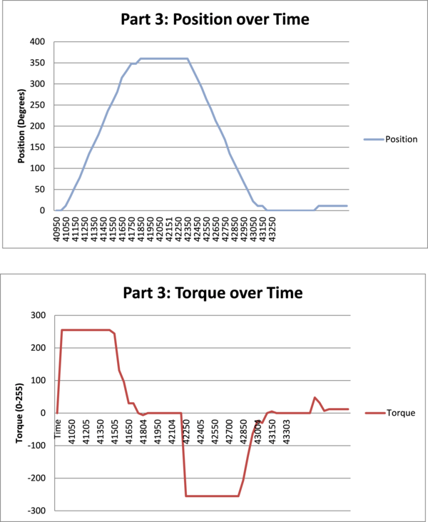
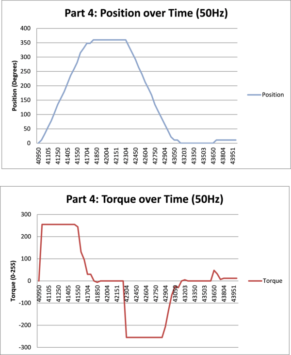

Lab Assignment 2: PD Motor Control
----------------------------------

Assignment Description
======================

### Introduction

For this lab, you will implement a motor controller that can reach any
referenced motor position without significant oscillation using PD
control. Your goal is to find appropriate values for the gains Kd and
Kp in the PD equation, and find an appropriate "step size" for the
interpolator, both of which are described below.

Your system will be composed of the following parts:

 - A PD controller
 - A linear trajectory interpolator
 - A user interface

### PD Controller

The PD controller maintains the position of the motor using both the
reference and measured position of the motor. It is of the highest
priority in the system, and it should run at a frequency of 1KHz. The
controller that you will implement calculates a desired torque
according to the equation

    T = Kp(Pr - Pm) - Kd*Vm
 
where

    T = Output motor signal (torque) 
    Pr = Desired motor position 
    Pm = Current motor position 
    Vm = Current motor velocity (computed based on finite differences) 
    Kp = Proportional gain 
    Kd = Derivative gain

T is a signal that can be used directly to control the motor, except
check that it is in range { -TOP, TOP }, and use absolute(T) and set
motor direction appropriately.

Pm and Vm can be computed using the encoder attached to the motor. The
encoder generates a pair of signals as the motor shaft rotates, which
are used as input signals into 2 general I/O port pins on the
Orangutan. Using the Orangutan libraries (the wheel encoder example)
or your own code, set up pin change interrupts on these port pins and
count the number of signal changes to track the position of the motor.

Pr is provided through the user interface or as part of a hard-coded
trajectory.

Kp and Kd are the terms that you define that determine how your system
behaves. You will need to determine these values experimentally. See
discussion below under trajectory interpolator to figure out where to
start with these values. You should always be generating motor
commands, regardless of whether the reference position is changing or
not. This means that at any time, if you move the wheel manually, then
the PD controller should bring it back to the current reference
position. In other words, even if the motor is where it should be, do
not stop sending commands to the motor, instead send it 0 (or whatever
torque value your controller produces).

### Motor

The motor is attached to the Motor2 port of the Orangutan. This
corresponds to OC2B for the PWM drive signal and PC6 as the
directional signal. You should write your own code to control the
motor, but you may use the Orangutan code as reference material. You
use the torque value generated from the controller to adjust the duty
cycle of the waveform, thus the speed of the motor. The motors we are
using are Solarbotics Gear Motor 2 motors, and the encoders are
Solarbotics Wheel Watcher Rotation Encoders. These items can be found
at the following websites: http://www.solarbotics.com/products/gm2/
http://www.solarbotics.com/products/gmww02/

### Trajectory Interpolator

For this lab, the interpolator mainly serves the purpose of managing
the reference (desired) position and feeding it to the PD controller
to execute a complete trajectory (e.g. rotate forward 360 deg, rotate
backwards 90 deg, rotate forward 10 deg). The trajectory interpolator
is more meaningful when there are multiple motors that need to arrive
at a given point at the same time.

One potential problem with the PD controller is that the error term
(Pr-Pm) can start arbitrarily large, yet is vey small when close to
the reference position. This makes it difficult to find values for Kp
and Kd that work well in all situations. To remedy this problem, you
will use the interpolator to bound the error term to a threshold of
your choosing. I will refer to this as your step size.

To get started with finding your Kp, Kd, and step size, think about
the equation:

    T = Kp(Pr - Pm) - Kd*Vm 

Your torque value needs to be in the range -TOP to TOP as you defined
it in setting up your PWM (Note: you don't feed negative values to
your motor, instead set the direction to reverse and give it a
positive torque value). Consider the point when the motor is first
starting to move (Vm is 0) and it is more than one step size away
(thus, Pr-Pm = step_size). If you want T to be close to TOP at this
point (although you might want to start at about TOP/2 to see how it
goes), then Kp is your only unknown and you can start with it
there. With this value, it is likely that your motor will be
oscillating around its reference position (overshooting). The Kd term
helps with this, so start adding that in to see if you can get rid of
it (at least most of it). Test your gains with reference positions
both very close and very far from its current position.

### User Interface

The user interface consists of the following commands at a minimum
(feel free to add in whatever makes your life easier for programming
and debugging):

    L/l: Start/Stop Logging (print) the values of Pr, Pm, and T. 
    V/v: View the current values Kd, Kp, Vm, Pr, Pm, and T 
    R/r : Set the reference position to degrees 
    P: Increase Kp by an amount of your choice* 
    p: Decrease Kp by an amount of your choice 
    D: Increase Kd by an amount of your choice 
    d: Decrease Kd by an amount of your choice 
    
    * The amount to increase or decrease the gain by depends on how you set up the PWM channel

### Deliverables

Hand in all of the code necessary to compile your project. Please put
sufficient comments in your code so that I can follow what you are
doing. Also, if your code is not working in some aspect, please
include that in your report. In addition, submit a report that
addresses the following:

 1. Experiment with the speed of the motor: Run your motor at full
    speed. Modify your gains to achieve position control at that speed
    (as best you can). Slow the motor down as much as possible. Modify
    your gains to acheive position control. Repeat with one or two speeds
    in between. For each, record the approximate speed in rotations per
    second, record your equation (gains), and report on the behavior of
    the system and your ability to control the position.
 2. Change the step size to something very large (more than 2pi), and
    try a reference position of 4pi+current_position. How does system
    behavior differ from your tuned step size? Try tuning your
    controller for that very large step size. What happens if you then
    set the reference position to be very close to the current
    position (within a few degrees)?
 3. Using your optimally tuned values for the PD controller running at
    1kHz, graph Pm, Pr and T while executing the trajectory: rotate
    the motor forward 360 degrees, hold for .5 seconds, then rotate
    backwards for 360 degrees, hold for .5 seconds, rotate forwards for
    5 degrees. Be sure to graph the entire trajectory.
 4. Run your PD controller at 50Hz and 5Hz while graphing the same
    variables. Discuss the results.

Lab Report
==========

Note:
Unless otherwise stated, the following defaults are used in these
experiments:
 - step size: 90 degrees
 - Kp: 325
 - Kd: 50

### Part 1: Motor Speed

> Experiment with the speed of the motor: Run your motor at full
> speed. Modify your gains to achieve position control at that speed
> (as best you can). Slow the motor down as much as possible. Modify
> your gains to achieve position control. Repeat with one or two speeds
> in between. For each, record the approximate speed in rotations per
> second, record your equation (gains), and report on the behavior of
> the system and your ability to control the position.
> 
> Clarification:
> Your motor has a certain range of speed - from full on to off. If you
> limit that range (say you never allow the motor to go above half speed),
> then you might need different gains to achieve your position. Conversely,
> extremely small and large gains might affectively change the range of the
> motor speed. 
> 
> For the experiment, essentially what I am asking is to set the gains very
> high so that your motor command is "maxed out" even with a small error. Then
> set your gains very low so that it is hard for it to ever "max out," despite
> the size of the error. Test these gains with relative close and far
> reference positions.
> 
> With regards to what to report, I am not looking for a "right" answer, rather
> a report of experimenting with the gains.

#### Speed: Full On

Getting the motor to go full on was achieved by modifying the Kp/Kd values
to be quite large.  The following gave "good" results where with both a 
small and large reference position, the motor jerked around the target
reference position at full torque.  Here this is shown for d/p at 100000
with a ref position of 5 (from 0).

    #> d 100000
    #> p 100000
    #> r 5
    #> l
    -11,5,255
    0,5,255
    11,5,-255
    0,5,-255
    -11,5,255
    0,5,255
    11,5,-255
    0,5,-255
    -11,5,255

#### Speed: Low Speed

For the low speed portion, I sought to find a p value such that the motor
would make some movement toward a reference position 15 degrees away from
the current position.

First, level at no motion with ref position:

    #> p 0
    #> d 0
    #> r+ 15
    #> v
    Kd=0, Kp=0, Vm=0, Pr=15, Pm=0, T=0

Now, increase p until there is motion:

    #> p 100
    #> v
    Kd=0, Kp=100, Vm=0, Pr=15, Pm=0, T=15 (no motion)
    #> p 200
    #> v
    Kd=0, Kp=100, Vm=0, Pr=15, Pm=0, T=15 (moved to position 11)
    #> p 150
    #> r+ 15 (target position 36)
    #> v
    Kd=0, Kp=150, Vm=0, Pr=22, Pm=22, T=0 (moved to position 22)

Here, we are seeing that with Kp ~= 150, Kd = 0, we are getting motion,
but not enough to make it close to our desired reference position.  With
150, we make it 354 degreees toward a 360 degree rotation.  Note that the
torque here maxes out at 135 (of 255) and at 354 is driving at torque 9
but not making any progress toward its goal.

    #> p 150
    #> d 0
    #> l
    #> r+ 360
    0,0,0
    0,360,0
    5,360,135
    16,360,135
    28,360,135
    50,360,135
    61,360,135
    84,360,135
    95,360,135
    112,360,135
    129,360,135
    140,360,135
    163,360,135
    174,360,135
    185,360,135
    208,360,135
    219,360,135
    241,360,135
    253,360,135
    270,360,135
    286,360,118
    298,360,102
    309,360,76
    320,360,60
    331,360,51
    331,360,43
    343,360,34
    343,360,25
    343,360,25
    343,360,25
    348,360,18
    354,360,9
    354,360,9
    354,360,9

### Part 2: Step Size Modifications

> Change the step size to something very large (more than 2pi), and
> try a reference position of 4pi+current_position. How does system
> behavior differ from your tuned step size? Try tuning your
> controller for that very large step size. What happens if you then
> set the reference position to be very close to the current
> position (within a few degrees)?

The step size was modified from the default (90 degrees) to be
much larger (720 degrees).  Here's the initial results of that
experiment.  The constant for this is MAX_DELTA in interpolator.c

    0,1440,0
    0,1440,255
    22,1440,255
    45,1440,255
    78,1440,255
    101,1440,255
    123,1440,255
    146,1440,255
    180,1440,255
    202,1440,255
    230,1440,255
    258,1440,255
    281,1440,255
    309,1440,255
    337,1440,255
    360,1440,255
    393,1440,255
    416,1440,255
    438,1440,255
    466,1440,255
    495,1440,255
    517,1440,255
    551,1440,255
    573,1440,255
    601,1440,255
    630,1440,255
    652,1440,255
    675,1440,255
    708,1440,255
    731,1440,255
    759,1440,255
    787,1440,255
    810,1440,255
    832,1440,255
    866,1440,255
    888,1440,255
    911,1440,255
    933,1440,255
    967,1440,255
    990,1440,255
    1023,1440,255
    1046,1440,255
    1068,1440,255
    1091,1440,255
    1125,1440,255
    1147,1440,255
    1170,1440,255
    1198,1440,255
    1226,1440,255
    1248,1440,255
    1282,1440,255
    1305,1440,255
    1327,1440,255
    1355,1440,255
    1383,1440,209
    1406,1440,96
    1428,1440,63
    1434,1440,27
    1440,1440,-3
    1440,1440,-3
    1440,1440,0

At 90 degrees, this was the results looks basically the same, with
small differences at the tail end...

    #> l
    #> r+ 1440
    ...
    1305,1440,255
    1327,1440,255
    1355,1440,255
    1383,1440,203
    1406,1440,134
    1423,1440,63
    1434,1440,30
    1440,1440,-5
    1440,1440,-3
    1440,1440,0

This makes some sense to me as the interpolator is going to be feeding a
value 90 or greater up until the very end for both algorithms.  The p/d
values are optimized to drive full strength when we are > 90 degrees
away from the target.  Near the target, the two are bound to act in
basically the same fashion.  So, that aren't really any differences
between the two (other than keeping values in line to make computation
a bit simpler to deal with).  If I had smaller datatypes for some stuff,
this could result in anamalous behaviour.

### Part 3: Graphing of Pm, Pr, and T

> Using your optimally tuned values for the PD controller running at
> 1kHz, graph Pm, Pr and T while executing the trajectory: rotate
> the motor forward 360 degrees, hold for .5 seconds, then rotate
> backwards for 360 degrees, hold for .5 seconds, rotateforwards for
> 5 degrees. Be sure to graph the entire trajectory.

Note that after this point, I added t (uptime in ms) to the list of
things logged.  The source for the graphs are in graphsource-part3.csv.
Note that the interpolator that I wrote maintains a queue of targets and
will automatically go to the next target after it has been in the
"endzone" (within 5 degrees) for 500ms.

    #> pause
    #> l
    #> r+ 360
    #> r 0
    #> pause

Full data results for this are in assets/lab2.xlsx.

### Part 4: Graph Again at 50/5Hz

> Run your PD controller at 50Hz and 5Hz while graphing the same
> variables. Discuss the results.

The results at 50Hz looked pretty similar to the results at 1Khz (note
that for all, we log state at 50Hz).  At 5Hz, significant problems began
to show up indicating that we are definitely not servicing the interpolator
and pd controller frequently enough.  It is of note that there does not seem
to be the same period of inactivity between hitting 360 and going back to
0 that we see with the others.  This is an artifact of two things: the position
being within the "endzone" for 500 ms and the less frequent updates to the
pd controller.  In this run, we were close enough to be within the
endzone, but it was clear the PD controller had not yet settled based on the
data.

Final Tweaks
============

From the previous sections data, it became clear to me that the values I
was using for the PD controller did not do a great job of hitting small
deltas like 5 or 15 degrees.  After some experimentation, here are the
results with a more optimized Kp, Kd in the same experiment that we
ended with and at 50Hz.  The change that was implemented was to increase
Kp to 375.

   #> pause
   #> p 375
   #> r 360
   #> r 0
   #> r 5
   #> l
   #> pause

